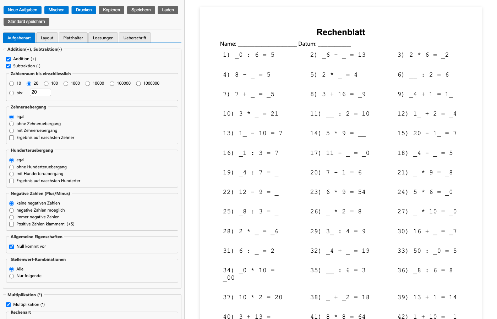
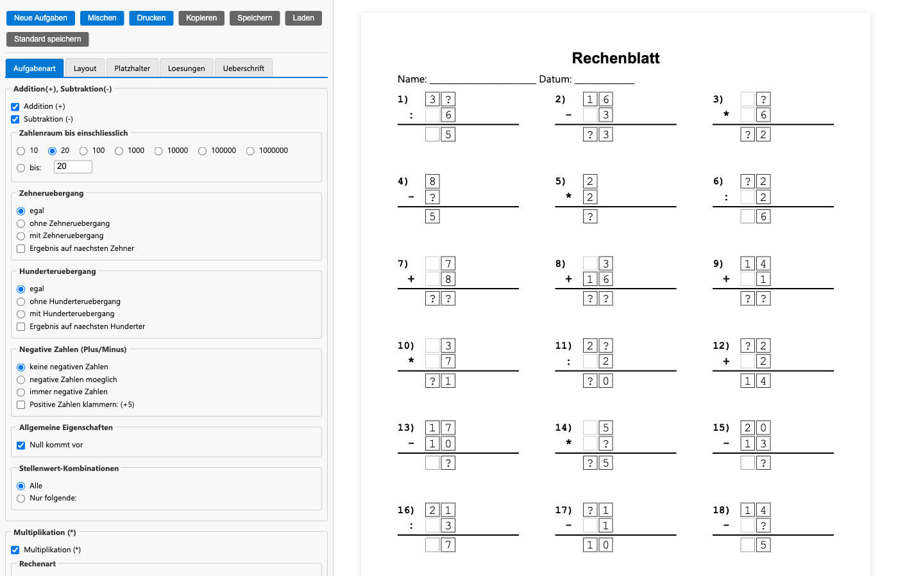

# Rechenblatt Web Edition

Webbasierte Neuimplementierung des Windows-Programms [Rechenblatt 3.1](https://www.pabst-software.de/doku.php?id=programme:rechenblatt:start) von Pabst-Software als einzelne HTML-Datei — ohne Abhängigkeiten, offline nutzbar, druckoptimiert.



## Features

- **Grundrechenarten**: Addition, Subtraktion, Multiplikation, Division
- **Zahlenräume**: 10 bis 1.000.000 (frei wählbar)
- **Einmaleins-Reihen**: 2er bis 20er, einzeln auswählbar
- **Filter**: Zehner-/Hunderterübergang, negative Zahlen, triviale Aufgaben unterdrücken, Stellenwert-Kombinationen
- **Darstellung**: Normal, schriftliche Rechnung (untereinander), Rechenkästchen (Einzelzellen)
- **Gespensteraufgaben**: Spaltenweise versteckte Ziffern
- **Platzhalter**: An beliebiger Position (Operand 1, Operand 2, Ergebnis)
- **Lösungen**: Auf Platzhalterstrich, unter Aufgabe, Spalte rechts, am Seitenende, durcheinander, Quersumme, separates Lösungsblatt
- **Layout**: Seite automatisch füllen (A4-optimiert), konfigurierbare Zeilen/Spalten, Schriftarten, Abstände, Nummerierung
- **Export**: Drucken, als Bild kopieren, .rbl-Datei speichern/laden, Standardeinstellungen speichern

### Rechenkästchen



### Gespensteraufgaben


### Platzhalter mit Lösungen


## Verwendung

`index.html` im Browser öffnen — fertig. Kein Server, kein Build, keine Installation.

```bash
# Optional: Lokaler Server für Entwicklung
python3 -m http.server 8787
```

## Ursprung

Diese Web-Edition ist eine Neuimplementierung des Windows-Programms **Rechenblatt 3.1** von Jürgen Pabst:

> https://www.pabst-software.de/doku.php?id=programme:rechenblatt:start

Das Original ist ein Delphi-Programm (Windows .exe) zur Erstellung von Mathematik-Arbeitsblättern für die Grundschule. Die Web-Version bildet die wesentlichen Funktionen in einer einzigen HTML-Datei ab und ergänzt sie um moderne Browser-Features (Vorschau, Responsive UI, localStorage).

## Lizenz

Dieses Projekt ist eine unabhängige Neuimplementierung und steht in keiner Verbindung zum Originalprogramm.
